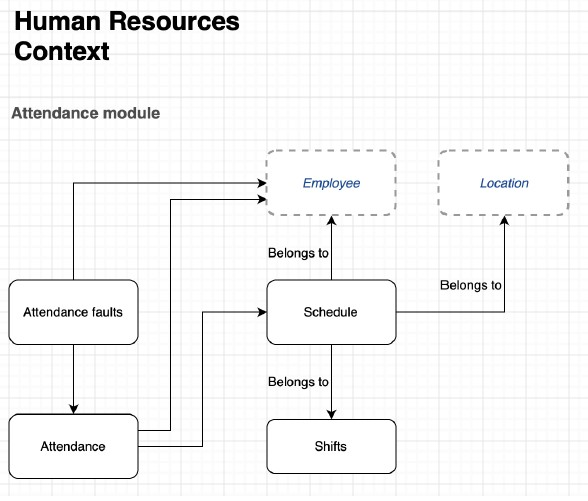

# connect-group-coding-test
Assessment to choose candidates for UAE Project from JIThpl


## Challenge 01

### Given Task

Creat a migration to support the below structure



Create an API endpoint to upload excel attendance and store data in the database.

Create an API endpoint to return attendance information of an employee with total working hours.

### Setup & Run Dev Environment

inside backend folder Run

```
composer install

npm install

php artisan migrate:fresh --seed

php artisan storage:link

php artisan serve

```

#### **API Endpoint for upload attendance**

URL: `api/attendance/upload`   
eg: `http://127.0.0.1:8000/api/attendance/upload`

API endpoint for uploading excel attendance accepts file with attribute `uploaded_file`.

